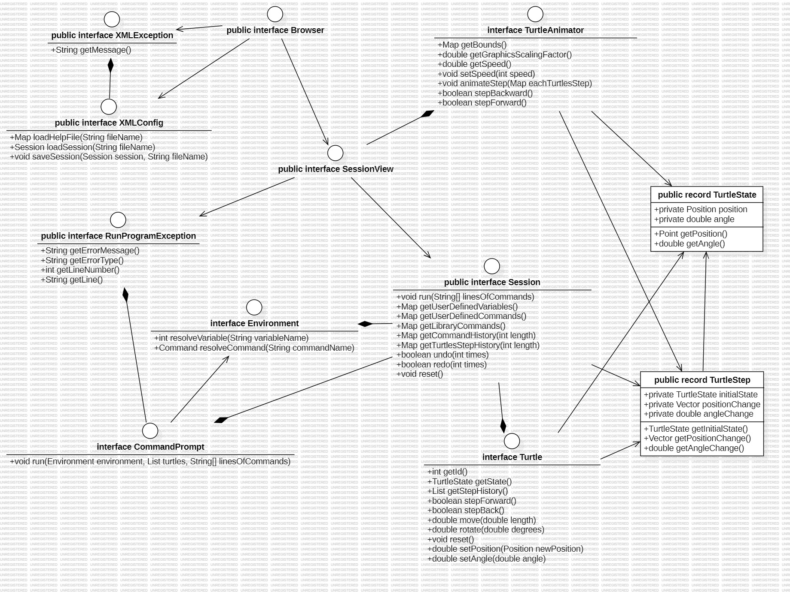

# SLogo Design Plan

### Judy He, Jason Qiu, Jordan Haytaian, Jeremyah Flowers

### TEAM #3

#### Examples

## Introduction

This project seeks to create an entertaining and educational experience for users who are looking to
work with commands/programming. The project will consist of an IDE for users to command a turtle to
create
custom drawings. Our team would like our project to be engaging and intuitive for users. In other
words,
we want to create an appealing interface that prioritizes ease of use. Behind the user experience,
we would like our code to be clean, reliable, and secure. Additionally, we will be devoting much
focus to
functionality and scalability- we want our program to meet the specified requirements, while also
being
easily adaptable to meet new specifications. To achieve our design goals, we plan to utilize the
View/Model
Separation Principle and implement several APIs to maintain class separation.

## Configuration File Format

The XML configuration files will contain information necessary to parse commands and provide help
documentation
to users. Each file will be specific to one command. The file will first contain the command's name
and alias, or
name used in the IDE environment. A description of the command will be provided along with an
example of its use.
Any parameters and return values will be documented and the number of parameters will be explicitly
declared.
Lastly, the class or method containing the command implementation will be listed. This field will be
especially
useful when documenting user-defined commands.  
[Forward Command](commands/forward.xml)  
[Sum Command](commands/sum.xml)

## Design Overview

The UI design will be handled by the Frontend internal and external API. The user will be able
to interact with the UI mainly through mouse events and the GUI's built-in command line. The
user will be able to input a command (i.e, `fd`, `bk`, etc.), and see the turtle being animated
in real time. These input commands will be parsed by the model and passed via a method such as
`passCommandToBeParsed`. The user will also be able to click different buttons such as pause/play,
2x speed, 5x speed, and pen colors. These will all be filtered using classes called `Input`
and `Animation`. Finally, the user can change the turtle or load a saved configuration via a
file selector. These interactions will be handled through a `XML` configuration class.

Updating and processing the turtle animation will be handled by the external and internal Model API.
To keep track of the turtle's position and heading, we will implement a `Point` class and a `Vector`
class as our bottom level of abstraction. The Point class will be used to track position while the
Vector class will be used to track angle and magnitude, the turtle's displacement between steps. To
calculate the turtle's next position or new heading, we will have a static protected
class `TurtleGeometry`, handling all `Vector` and `Point` related operations.
Moving up the levels of abstraction, to represent a turtle's state, its position and heading, we
will implement a `TurtleState` class. To then keep track of a turtle's sequence of steps, we will
implement a `TurtleStep` class that contains attributes like initial `TurtleState`, change in
position `Vector`, change in angle as well as whether the pen is down for that step.
This will allow us to efficiently step forward or back in the animation, replay the animation, and
change in the animation speed in the View. Moving further up the abstraction layers, we will
implement a `Turtle` class, which will contain attributes storing the turtle's unique id (this is to
allow to a possible future extension of having multiple turtles), initial state at the start of the
animation (`TurtleState`), current state (`TurtleState`), and the sequence of `TurtleStep` it has
taken.
Lastly, at the very top level of abstraction, we will have the static `TurtleAnimator` class which
defines the current graphics scaling factor, the animation speed and the bounds of the animation
window. It will also be responsible for generating the series of intermediate TurtleStates needed in
order for a turtle to smoothly perform a step, a change in postion or angle. It will also check
whether a `Turtle` is in bound after a `Step`.
Overall, by encapsulating all the logic behind the turtle's animation in the backend external and
internal APIs, the View will only need to call specific methods like `animateSteps()` and will
receive the list of `TurtleStates` needed to smoothly animate the turtle view.
Updating and processing the turtle animation will be handled by the external and internal Model API. 
To keep track of the turtle's position and heading, we will implement a `Point` class and a `Vector` class as our bottom level of abstraction. The Point class will be used to track position while the Vector class will be used to track angle and magnitude, the turtle's displacement between steps. To calculate the turtle's next position or new heading, we will have a static protected class `TurtleGeometry`, handling all `Vector` and `Point` related operations. 
Moving up the levels of abstraction, to represent a turtle's state, its position and heading, we will implement a `TurtleState` class. To then keep track of a turtle's sequence of steps, we will implement a `TurtleStep` class that contains attributes like initial `TurtleState`, change in position `Vector`, change in angle as well as whether the pen is down for that step.
This will allow us to efficiently step forward or back in the animation, replay the animation, and change in the animation speed in the View. Moving further up the abstraction layers, we will implement a `Turtle` class, which will contain attributes storing the turtle's unique id (this is to allow to a possible future extension of having multiple turtles), initial state at the start of the animation (`TurtleState`), current state (`TurtleState`), and the sequence of `TurtleStep` it has taken. 
Lastly, at the very top level of abstraction, we will have the static `TurtleAnimator` class which defines the current graphics scaling factor, the animation speed and the bounds of the animation window. It will also be responsible for generating the series of intermediate TurtleStates needed in order for a turtle to smoothly perform a step, a change in postion or angle. It will also check whether a `Turtle` is in bound after a `Step`. 
Overall, by encapsulating all the logic behind the turtle's animation in the backend external and internal APIs, the View will only need to call specific methods like `animateSteps()` and will receive the list of `TurtleStates` needed to smoothly animate the turtle view. 

To run code, all the view needs to do is pass lines of code to the `run` external API method in `Session`,
which will dispatch to the `run` internal API method in CommandPrompt, which will handle it all.
`RunProgramException` exceptions may be thrown, which will should be caught by the caller in the view.
It will contain debugging information such as error type, message, line number, and line position.

Commands will be abstracted using the `Command` class and will all take a certain number of arguments
and `Turtle`s to perform those commands on if needed.

The view can also go backwards and forwards in history by using `undo` and `redo` in `Session` which will
internally maintain both the command history and turtle step history so that they are always in sync.

The view can get the command history and turtle step history of variable lengths from `Session` as well.

## Design Details

`Page`
This abstract class creates a new page. This can be passed several different implementations of a
page including the GUI for turtle animation and the splash screen.

`SlogoWindow`
This class is the main area the user interacts with the animation, it can used to create any
number of pages. Any user interactions with the window will automatically go the page and vice
versa.

`Button`
This abstract class will have different implementations of the buttons needed to process user
queries. For example, there will be load/save, pause/play, speed buttons.

`CommandLine`
This class displays and takes in information from the built-in command line. It should be called on
by the parser.

`Observer/Controller`
This class will wait for user queries passed via the buttons and pass the information it receives.

`Point`

This class is part of the Model internal API and will contain 2 attributes of type double: x, y.
This is one of the classes at the bottom level of abstraction for representing a position in the
animation. Classes related to turtle animation in the backend internal and external APIs as well as
the Controller in the frontend will depend on this class to update the turtle's position and the
drawing.

`Vector`

This class is part of the Model internal API and will contain attributes of type double: dx, dy,
angle, magnitude. This is one of the classes at the bottom level of abstraction for calculating
distance and angle between `Point` objects. Classes related to turtle animation in the backend
internal API will depend on this class.

`TurtleState`

This is a class part of the external Model API used to represent an immutable state of the turtle.
It will contain attributes Point `position` and double `angle`. Classes higher in abstraction level
will depend on this class. It also serves to represent an animation step for animating the turtle's
motion.

`TurtleStep`

This is a class part of the Model internal and external API and is at the next higher level of
abstraction. It will contain attributes: `TurtleState` initialState, `Vector` positionChange,
and `double` angleChange. A `TurtleStep` object represents a step, a change in distance or heading,
the turtle has taken in the animation.

`TurtleGeometry`

This class will be a protected static class part of the Model internal API, another layer of
abstraction, that handles all operations related to calculating values such as the distance
travelled, the next position, and the heading of the turtle. Methods will
include: `calculateAngle(Vector v1, Vector v2), calculateMagnitude(Vector v),
calculateXComponent(Vector v, double angle), calculateYComponent(Vector v, double angle),
calculateFinalPosition(Point initialPosition, double distance),
double dotProduct(Vector v1, Vector v2),
double crossProduct(Vector v1, Vector v2)`.
The method signatures do not reveal the implementation details of the turtle animation used given
that the TurtleGeometry only performs operations on the more abstract classes `Point` and `Vector`.

`Turtle`

This class will represent a turtle in the animation and is towards the top level of abstraction. It
will depend on the more abstract
classes `Point`, `Vector`, `TurtleState`, `TurtleStep`, `TurtleGeometry`. Attributes include the
turtle's: int id, TurtleState state, List<TurtleStep> stepHistory. In the Model internal API, the
methods `move(double distance)` and `rotate(double angle)` allow the turtle to update its position
or heading. In the Model external API, user will be able to the get all the turtle's attributes as
well as call public methods
including: `doStep(double length, double angle), stepForward(), stepBack(), reset()`. These method
signatures keep all implementation details encapsulated given that one is not able to read any data
structures or classes involved at the bottom level of abstraction.

`TurtleAnimator`

This class will be public static and is at the top level of abstraction. It is for storing all
parameters related to the animation environment. Attributes include the bounds of the animation
window to be generated by the View, the graphic scaling factor, speed of animation, and a Map
mapping turtle ids to the series of `TurtleStates` needed to create the turtle animation for a given
step. As part of the Model external API, it will contain method `animateStep()` to calculate the
series of `TurtleState` needed to animate the turtle smoothly over a `TurtleStep` (change in
position or angle) at a certain animation speed. `animateSteps()` will store the result in a local
Map variable that maps turtle id to the list of `TurtleStates` needed to smoothly animate the
Turtle. This satisfies SLOGO 75 and 76. To replay, pause, play step forward, or step back in the
animation, the View will only need to obtain list of the TurtleStates needed for a turtle at each
step by calling `stepForward()` or `stepBackward()`.
As part of the Model internal API, it will contain a method `checkBounds()` to validate whether the
turtle is within bound of the animation window after performing a `TurtleStep`.

`Session`

This public class will represent the IDE and command-running interface of the program. 
It serves external API methods by acting as a middleman for Turtle and CommandPrompt.
It will also contain command history info and contains some other functionality encapsulated within individual sessions.

`CommandPrompt`

This package-level class will handle running strings of code. 
It does this by combining the functionality of the Tokenizer and Parser classes to compile the code
into a list of Commands that can be run sequentially.

`Command`

This abstract package-level class will be the abstraction for any given command, which takes arguments,
Turtles to act on, the Environment to resolve variables, etc. things needed to run commands.
It sends messages to the given Turtles to do certain things or simply performs logic or math operations.

`RunProgramException`

This abstract public class will be an abstraction for any exception that occurs while running code
and will contain debugging info such as line number and position the error occurred, the error type,
and the error message.

## Design Considerations

We considered the possiblity for extension with simultaneous sessions (possibly represented as tabs in some main browser),
leading us to create a `Session` class in the design, which also simplified the model's external API.

Special types of exceptions under a superclass of `RunCommandException` for running commands were considered in case debugging information
is needed in the change specification.

`TurtleAnimator` was created to delegate the animation aspect of the program away from the view and into the model, 
simplifying the view's complexity. It also handles any playback that the view requires after getting the step history of turtles from `Session`.

`undo` and `redo` functionalities were included in `Session` so that the user can undo commands, which alters both command and turtle step history.
Having this function in `Session` allows for both command history and turtle step history to stay in sync.

In the consideration that there could possible be multiple turtles running at once in a single session:
- `run` in `CommandPrompt` and `animateEachTurtlesStep` was extended to take a list of turtles instead
- `Session` maintains a list of currently selected turtles
- `Turtle` was extended to additionally hold an ID so that the user could select each one individually using commands

## Test Plan

In creating a design plan, our team prioritized making the APIs easily testable. One strategy we
will
be implementing is close adherence to the Single Responsibility Principle. When classes and methods
are tightly scoped, it becomes easier to test for expected behavior. In other words, it is easier to
check for
compliance with one purpose than it is with many. Another strategy our team discussed is exception
handling.
We will be implementing robust exception handling, as this helps our tests determine whether our
program
correctly handles errors. Anticipated test scenarios for project features are listed below:

* Feature #1: Get user defined commands
    * Test Case 1: Supply commands via a program, check that the commands matches the those defined
      in the program
    * Test Case 2: Request user defined commands when no commands have been defined, verify that no
      commands are returned
    * Test Case 3: Supply commands with syntax errors via a program, check that the commands
      returned are accurate and that the correct exceptions are thrown
* Feature #2: Get help documentation
    * Test Case 1: Request help documentation, verify that all commands and descriptions are shown
    * Test Case 2: Request help documentation in a non-english language, verify that all commands
      and descriptions and shown and translated correctly
    * Test Case 3: Call help documentation when help overview window is not active, verify that
      documentation is not shown/ exception is thrown
* Feature #3: Running commands
    * Test Case 1: Supply commands via a program, check that the correct steps are created
    * Test Case 2: Supply commands that do not move the turtle via a program, check that no steps
      are created
    * Test Case 3: Supply commands with syntax errors via a program, check that steps are not
      created for errored commands and that the correct exceptions are thrown
* Feature #4: Get command history
    * Test Case 1: Supply commands via a program, check that the command history matches the input
      program
    * Test Case 2: Run a program and then reset, verify that previous history is not shown
    * Test Case 3: Supply commands with syntax errors via a program, check that command history is
      accurate and that the correct exceptions are thrown

## Team Responsibilities

* Team Member #1: Judy He
    * Primary: Implement the part of the Model internal and external APIs for animating the turtle.
      Debug all issues related to turtle animation.
    * Secondary: Create test cases, help teammates with debugging and planning.

* Team Member #2: Jeremyah Flowers
    * Primary: Implement the external portion of the Frontend/View API and the UI display
    * Secondary: Help with internal framework for button/error handling

* Team Member #3: Jordan Haytaian
    * Primary: Implement the XML configuration files and parsing functionality, create comprehensive
      testing
    * Secondary: Help with front-end implementation as needed

* Team Member #4: Jason Qiu
    * Primary: Implement tokenizer, parser, command evaluation, all commands, and session history functionality.
    * Secondary: Help with design and implementation in other parts of the project if needed.

### Timeline
#### By 2/25
- Push up and merge all external API boilerplate classes and methods into main
- Get minimally-implemented functionality for all parts done
#### By 3/3
- Fulfill full Basic specification on main
#### By 3/8
- Fulfill full Changed specification on main
